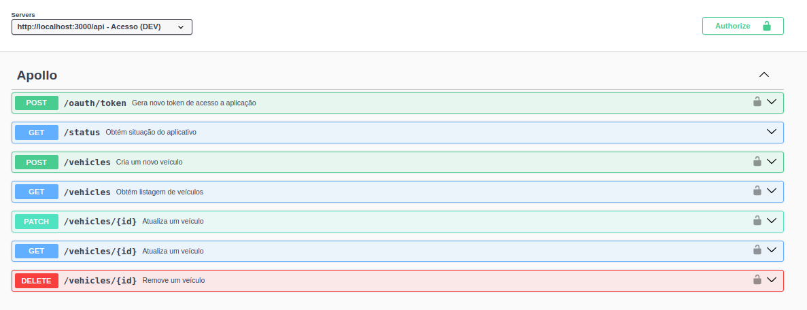

<h1 align="center">
    Apollo
</h1>
<p align="center">
    
</p> 
<h3 align="center">
    Base para construção de APIs Rest com NodeJS e Typescript
</h3>

## Início Rápido

```bash
git clone https://github.com/realfabecker/apollo.git
cd apollo
docker compose up
```

## Instalação e Uso

O uso recomendado do projeto é por seu ambiente [Docker](https://docs.docker.com/engine/install/). Pode-se também ser realizada instalação manual, porém essa 
irá exigir a instalação local em seu ambiente do [NodeJS v16](https://nodejs.org/en).

### Execução a partir de containers Docker

Clone o repositório apollo em seu ambiente local e realize a compilação do projeto:

```bash
docker compose build
```

Com o projeto disponível será possível inicializar a ambiente com suas configurações padrão:

```bash
docker compose up
```

### Execução local com NodeJS

Assegure-se de ter o NodeJs devidamente instalado caso optado por não utilizar os containers do projeto.

Tendo realizado o clone do projeto realize a instalação das dependências de aplicação

```bash
npm install
```

Crie um arquivo .env local para desenvolvimento e exporte suas configurações

```bash
cat <<'EOL' > .env.local
APOLLO__PORT=3000
APOLLO__HOST=http://localhost
APOLLO__TOKEN=123aAxZc&6V!
NODE_ENV=development
EOL

export $(cat .env.local)
```

Inicie o projeto em modo watch considerando cenário de desenvolvimento

```bash
npm run watch
```

### Acesso ao projeto localmente

A partir da instalação do projeto este terá sua interface http na porta 3000

```bash
curl -v http://localhost:3000/api/status
```

A interface openapi do projeto pode ser acessada por http://localhost:3000/api/docs



## Estrutura do Projeto

### ./src/core

**Diretório contendo definição relacionada apenas as regras de negócio** do aplicativo, não é de sua responsabilidade
saber qual tecnologia utilizadas como em persistência ou cache.

* `/src/core/ports` definição de interfaces da aplicação.
* `/src/core/services` definição de serviços representando a regra de negócio do projeto.
* `/src/core/domain` definição de entidades e/ou schemas de objetos manipulados pelo negócio.

### ./src/adapters

**Diretório contendo a implementação das interfaces do aplicativo**, é neste que são definidos os níveis mais baixos de
implementação necessários para atender os requisitos de regra de negócio estipulados pelas interfaces da aplicação.

* `/src/adapters/logger` definição de implementação de interface de logging.
* `/src/adapters/config` definição de implementação de interface de configuração.

### ./src/handlers

**Diretório contendo implementação de pontos de entrada do aplicativo** representando as interfaces disponibilizadas
como abertura para acesso às regras de negócio da aplicação.

* `/src/handlers/cmd` implementação de camada de acesso por linha de comando.
* `/src/handlers/http` implementação de camada de acesso por http.

### ./docs

**Diretório contendo a documentação relacionado ao projeto** utilizado como referência para consulta.

* `/docs/specs` definição de componentes utilizados na documentação [openapi](https://swagger.io/specification/)
* `/docs/images` relação de imagens referenciadas nos arquivos de documentação

### ./bin

**Diretório contendo unicamente o executável da aplicação** sendo utilizada como ponto de entrada do aplicativo.

* `/bin/cmd` definição de executável de linha de comando.
* `/bin/http` definição de executável de interface http.

## Compilação

O processo de compilação / publicação do projeto deve ser realizado por seu respectivo [Makefile](./Makefile)

```bash
BUILD_NUMBER=1 make build
```

A partir desse sera realizado a compilação dos artefatos do projeto considerando a linguagem base bem como a publicação
de imagem docker no registro de imagens definido na configuração de compilação.

## Change log

Veja o [CHANGELOG](./CHANGELOG.md) para informações sobre as alterações mais recentes aplicadas no projeto.

## Contribuições

Refira-se ao guia de [contribuições](./docs/CONTRIBUTING.md) para detalhes de como contribuir para o projeto.

## Licença

Este projeto considera a licença MIT. Verifique a [Licença](LICENSE.md) para mais informações.